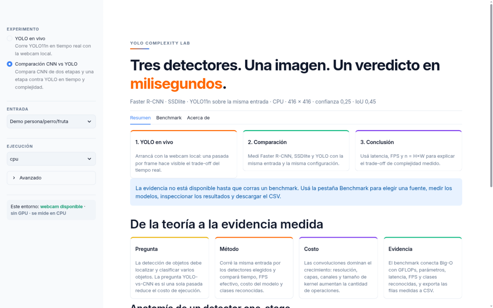
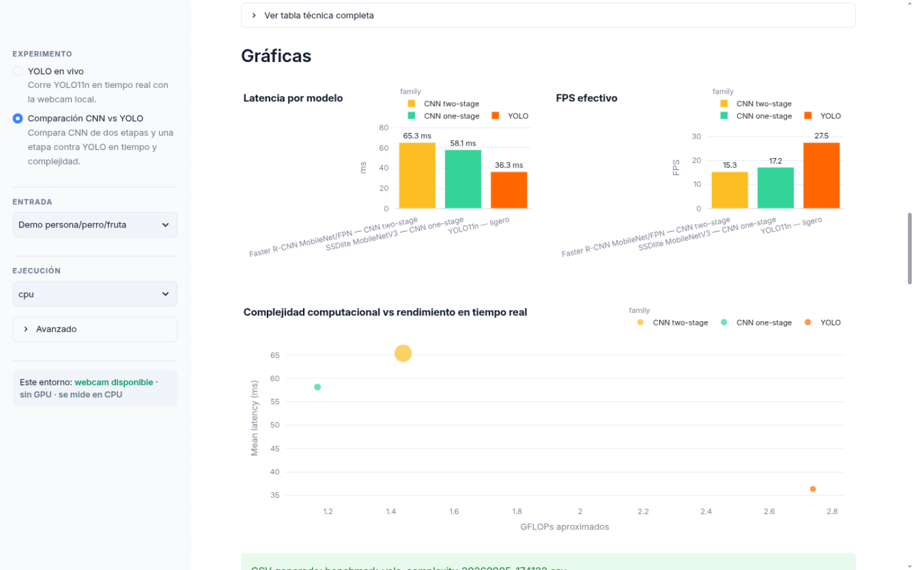

# YOLO Complexity Lab

[](https://github.com/AlejandroTatum/yolo-complexity-lab/actions/workflows/ci.yml)
[](https://github.com/AlejandroTatum/yolo-complexity-lab)
[](LICENSE)
[](https://streamlit.io)

[English](README.md) | **Español**

Laboratorio local en Streamlit que corre **YOLO en tiempo real** y compara **tiempo de ejecución** y **complejidad computacional** frente a detectores CNN clásicos. Creado como experimento de portfolio para una materia universitaria de complejidad computacional.

🔗 **Demo en vivo:** [yolo-complexity-lab-unl.streamlit.app](https://yolo-complexity-lab-unl.streamlit.app/)



## Por qué

La detección de objetos debe localizar y clasificar varios objetos por imagen. La pregunta YOLO-vs-CNN es si una **sola pasada** sobre la imagen reduce el costo de ejecución. Este laboratorio convierte esa teoría en un experimento medible: mismo input, misma configuración, arquitecturas distintas.

El recurso no intenta demostrar mAP. El reconocimiento es un apoyo visual; la evidencia es tiempo y costo.

## Qué mide

| Métrica | Significado |
| --- | --- |
| Latencia media / p95 | Tiempo por frame — menor es mejor |
| FPS efectivo | Throughput en tiempo real — mayor es mejor |
| `n = H × W` | Tamaño de entrada: el eje sobre el que crece la complejidad |
| MACs / GFLOPs | Operaciones aproximadas por frame (1 MAC ≈ 2 FLOPs) |
| Parámetros | Pesos aprendidos: tamaño, memoria, capacidad |
| Clases reconocidas | Apoyo visual para el input elegido, no una métrica formal de precisión |

## Cómo funciona

El panel lateral ofrece tres rutas de comparación; las rutas no soportadas se ocultan automáticamente según el entorno (local vs cloud):

1. **YOLO live** — transmite la webcam local por YOLO11n y muestra latencia, FPS y detecciones frame a frame.
2. **CNN vs YOLO comparison** — mide `fasterrcnn_mobilenet_v3_large_320_fpn` (two-stage), `ssdlite320_mobilenet_v3_large` (one-stage) y `yolo11n` sobre el mismo input, muestra los ganadores y exporta un CSV.
3. **Custom weights** — corre un `best.pt` local opcional (por ejemplo, un modelo de gestos) si el archivo existe en la raíz del repo.

Fuentes de frames: imagen demo persona/perro/fruta incluida, tu propia foto (procesada en vivo) o la webcam local. La pestaña Benchmark superpone las detecciones reales de cada modelo sobre la entrada — elegí un chip de modelo, montá tu foto y corré.



## Instalación rápida

> Usá un entorno virtual; no instales con el `pip` del sistema.

```bash
git clone https://github.com/AlejandroTatum/yolo-complexity-lab.git
cd yolo-complexity-lab
python3 -m venv .venv
source .venv/bin/activate
python -m pip install --upgrade pip
python -m pip install -r requirements.txt
```

Para una instalación solo CPU, instalá PyTorch primero para no bajar wheels de CUDA:

```bash
python -m pip install torch torchvision --index-url https://download.pytorch.org/whl/cpu
python -m pip install -r requirements.txt
```

Ejecutá el lab localmente (habilita webcam, streaming y opciones CUDA):

```bash
YOLOLAB_ENV=local streamlit run app.py
```

Los pesos de los modelos se descargan en el primer uso a `~/.cache/yolo-complexity-lab/weights/`; quedan fuera del repositorio.

## El Big-O detrás del lab

Costo convolucional principal:

```text
O(Σ_l H_l × W_l × C_in_l × C_out_l × K_l²)
```

Versión didáctica con `n = H × W`:

```text
O(L × n × C_in × C_out × K²)
```

Postprocesamiento con NMS:

```text
O(B²)
```

Los detectores two-stage agregan costo por regiones:

```text
O(Σ conv + R × C_roi + NMS)
```

## Estructura del proyecto

```text
.
├── app.py                      # UI Streamlit: layout, tabs, gráficos, CSS
├── src/yolo_complexity_lab/    # benchmark, catalog, loaders, complexity, system info
├── scripts/smoke_check.py      # smoke checks estáticos + de servidor
├── tests/                      # suite de pytest
├── assets/                     # imagen demo (persona/perro/fruta)
├── docs/                       # guía visual + screenshots
└── .streamlit/config.toml      # tema global
```

## Tests y CI

```bash
.venv/bin/python scripts/smoke_check.py            # contratos estáticos
.venv/bin/python scripts/smoke_check.py --server   # levanta Streamlit y prueba /healthz y /
.venv/bin/pytest -q                                # suite completa
```

GitHub Actions corre los smoke checks y la suite de tests en Python 3.11–3.13 para cada pull request.

## Deployment

La app se despliega en Streamlit Community Cloud con `app.py` como archivo principal. Los entornos desconocidos (sin `YOLOLAB_ENV`) y `YOLOLAB_ENV=cloud` usan un contrato de capacidades restringido: las rutas con webcam se ocultan y solo se ofrece CPU. Mirá [DEPLOY.md](DEPLOY.md) para la guía completa y el playbook de recuperación.

## Roadmap

- [ ] Toggle de tema claro/oscuro para distintas aulas y proyectores
- [ ] Evaluación cuantitativa estilo mAP sobre un dataset fijo
- [ ] Fuente de video además de imagen y webcam
- [ ] Comparación en vivo de varios modelos lado a lado

## Créditos

La imagen demo incluida combina `zidane.jpg` (asset de ejemplo de Ultralytics) y una foto de perro con banana de Karsten Winegeart en Unsplash (`de5wBys0nok`). Se usa solo como lámina didáctica para comparar reconocimiento, falsos positivos y tiempos.

## Licencia

[MIT](LICENSE)
